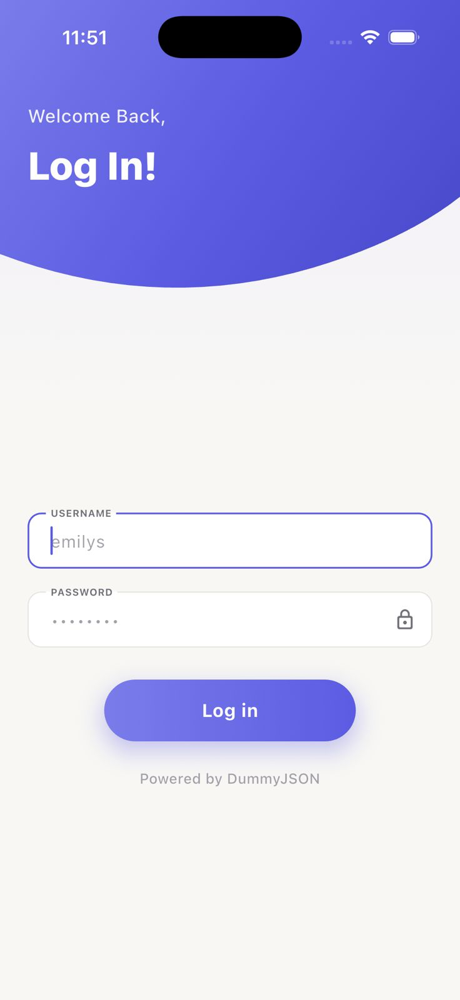
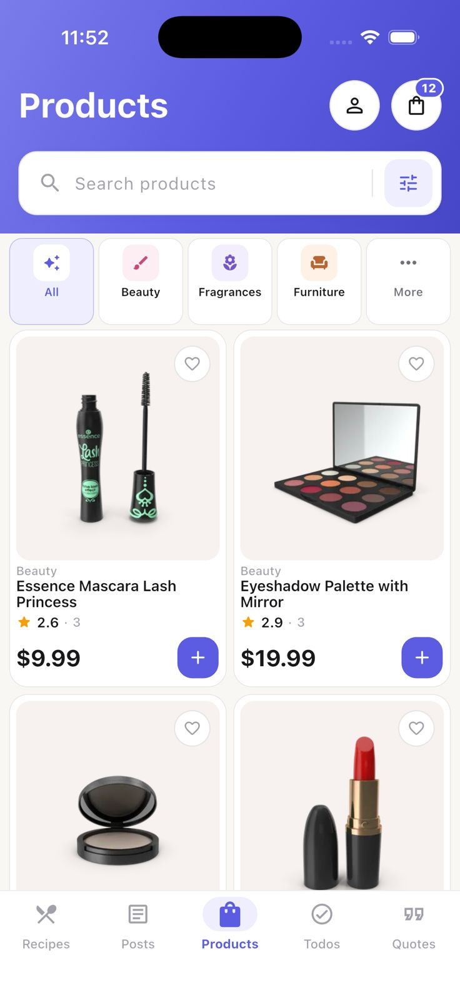

<div align="center">
  

  # Dummy

  **Products, content, and everyday tools—all in one place.**

  Dummy brings shopping, recipes, posts, quotes, todos, and user interactions
  together in one clean and unified Flutter experience.
</div>

---

## About

Dummy is a cross-platform Flutter application that combines products, shopping
tools, recipes, posts, quotes, todos, and user management in a single modern
mobile experience.

The project was built as a practical showcase of:

- REST API integration
- Authentication workflows
- Reusable Flutter components
- Responsive mobile layouts
- Asynchronous data handling
- CRUD operations
- Loading, empty, success, and error states
- Modern UI design and micro-interactions

The application uses the [DummyJSON REST API](https://dummyjson.com/) as its
backend service.

> [!NOTE]
> DummyJSON is a mock REST API. Create, update, and delete requests return
> realistic responses, but changes are not permanently stored on the server.

---

## Preview

<div align="center">
  
  
  
</div>

---

## Features

### Authentication

- Sign in using a valid DummyJSON account
- Form validation and user-friendly error messages
- Password visibility control
- Loading state during authentication
- Automatic navigation after successful login

### Products

- Browse products from DummyJSON
- Search products by name
- Filter products by category
- View product ratings and prices
- Open detailed product pages
- Add products to favorites
- Add products to the shopping cart
- Responsive two-column product grid

### Shopping Cart

- View products added to the cart
- Add new products
- Update product quantities
- Remove products
- Calculate cart totals
- Display success and error feedback

### Recipes

- Browse available recipes
- Search and filter recipe content
- View ingredients and preparation instructions
- Open detailed recipe pages

### Posts and Comments

- Browse and search posts
- View post details and interactions
- Create new posts
- Edit existing posts
- Delete posts
- Explore comments and engagement data

### Todos

- Browse daily tasks
- Filter completed and pending tasks
- Add new todos
- Update task information
- Mark tasks as completed
- Delete todos

### Quotes

- Discover quotes from DummyJSON
- Browse quote content in a clean reading experience

### Users

- Browse user profiles
- Search and filter users
- View detailed user information
- Add and edit user data
- Perform user-management actions

### User Experience

- Animated splash experience
- Custom Dummy visual identity
- Loading skeletons
- Empty and error states
- Feedback messages
- Responsive layouts
- Reusable UI components
- Smooth micro-interactions
- Consistent Soft Indigo design system

---

## Design System

Dummy uses a custom **Soft Indigo + Warm Neutral** visual identity.

| Token | Color |
| --- | --- |
| Primary | `#5B5CE2` |
| Primary Dark | `#4647C7` |
| Primary Soft | `#EEEEFF` |
| Background | `#F8F7F4` |
| Surface | `#FFFFFF` |
| Text Primary | `#18181B` |
| Text Secondary | `#71717A` |
| Border | `#E7E5E4` |
| Success | `#16A37A` |
| Warning | `#F59E0B` |
| Error | `#E5484D` |

The interface uses neutral surfaces and controlled indigo accents to maintain
strong readability without overwhelming the content.

---

## Built With

- [Flutter](https://flutter.dev/)
- [Dart](https://dart.dev/)
- [Material Design](https://m3.material.io/)
- [`http`](https://pub.dev/packages/http) for REST API communication
- [DummyJSON REST API](https://dummyjson.com/docs)
- Flutter Test for widget and interaction tests

---

## Project Structure

```text
lib/
├── core/
│   ├── app_page_route.dart  # Navigation transitions
│   └── theme/               # Colors, spacing, typography, and themes
├── models/                  # Application data models
├── screens/
│   ├── auth/                # Login flow
│   ├── carts/               # Shopping-cart flow
│   ├── comments/            # Comment management
│   ├── main/                # Main navigation shell
│   ├── posts/               # Post list, details, create, and edit flows
│   ├── products/            # Products and product details
│   ├── quotes/              # Quotes
│   ├── recipes/             # Recipes and recipe details
│   ├── splash/              # Animated splash experience
│   ├── todos/               # Todo management
│   └── users/               # User list, details, and management
├── services/                # DummyJSON API clients
├── widgets/                 # Shared and reusable UI components
└── main.dart                # Application entry point
```

---

## Getting Started

### Prerequisites

Before running the project, make sure you have:

- [Flutter SDK](https://docs.flutter.dev/get-started/install)
- Dart SDK, included with Flutter
- Android Studio, Xcode, VS Code, or another Flutter-compatible IDE
- An emulator, simulator, browser, or connected physical device

Verify your Flutter installation:

```bash
flutter doctor
```

### Installation

1. Clone the repository:

   ```bash
   git clone https://github.com/emiresers/all-in-one-lifestyle-app.git
   ```

2. Enter the project directory:

   ```bash
   cd all-in-one-lifestyle-app
   ```

3. Install the dependencies:

   ```bash
   flutter pub get
   ```

4. Check the available devices:

   ```bash
   flutter devices
   ```

5. Run the application:

   ```bash
   flutter run
   ```

To run the application on a specific device:

```bash
flutter run -d <device-id>
```

---

## Authentication

Dummy uses the DummyJSON authentication service. Use a valid test account
listed in the [DummyJSON authentication documentation](https://dummyjson.com/docs/auth).

Example request:

```http
POST https://dummyjson.com/auth/login
Content-Type: application/json

{
  "username": "your-test-username",
  "password": "your-test-password"
}
```

> [!IMPORTANT]
> Do not use real personal credentials. DummyJSON accounts are public test data.

---

## API

Base URL:

```text
https://dummyjson.com
```

Main resources used by the application:

```text
/auth
/products
/carts
/recipes
/posts
/comments
/todos
/quotes
/users
```

See the complete [DummyJSON API documentation](https://dummyjson.com/docs).

---

## Testing

Run the complete test suite:

```bash
flutter test
```

Run a specific test file:

```bash
flutter test test/<test-file-name>.dart
```

The project includes a foundation for:

- Widget testing
- Splash-screen behavior
- Product-card interactions
- Navigation testing
- Loading and error states

---

## Code Quality

Analyze the project:

```bash
flutter analyze
```

Format the source code:

```bash
dart format .
```

Check for outdated dependencies:

```bash
flutter pub outdated
```

---

## Supported Platforms

The Flutter project provides a cross-platform foundation for:

- Android
- iOS
- Web
- macOS
- Windows
- Linux

Platform-specific behavior and visual details may vary depending on the target
device and operating system.

---

## Roadmap

- Add persistent user sessions
- Store favorites locally
- Introduce structured state management
- Add offline caching
- Expand automated test coverage
- Add localization
- Add dark mode
- Improve accessibility support
- Add pagination and infinite scrolling
- Publish production builds for mobile and web

---

## Contributing

Contributions are welcome.

1. Fork the repository.
2. Create a feature branch:

   ```bash
   git checkout -b feature/your-feature-name
   ```

3. Commit your changes:

   ```bash
   git commit -m "Add your feature"
   ```

4. Push the branch:

   ```bash
   git push origin feature/your-feature-name
   ```

5. Open a pull request with a clear description of your changes.

---

## License

This project is licensed under the [MIT License](LICENSE).

---

## Acknowledgements

- [Flutter](https://flutter.dev/) for the cross-platform framework
- [DummyJSON](https://dummyjson.com/) for the mock REST API
- [Material Design](https://m3.material.io/) for interface guidelines

---

<div align="center">
  
  <br />
  <br />
  Built with Flutter and powered by DummyJSON.
</div>
